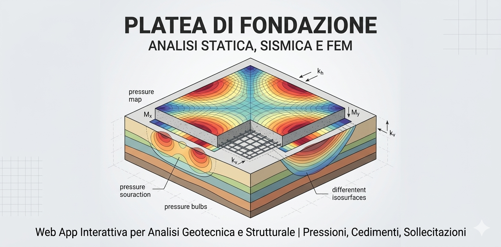

# Platea di Fondazione - Analisi Statica, Sismica e FEM


Un'applicazione web interattiva sviluppata in Python e Streamlit per l'analisi geotecnica e strutturale delle platee di fondazione. Il software valuta le pressioni di contatto, i cedimenti e le sollecitazioni interne (momenti flettenti) in condizioni statiche e sismiche, tenendo conto della stratigrafia del terreno e della presenza di falda acquifera.

## 🚀 Caratteristiche Principali
* **Modellazione Multistrato**: Gestione avanzata della stratigrafia del suolo con calcolo del modulo di Winkler equivalente.
* **Analisi Statica e Pseudo-statica**: Integrazione dei coefficienti sismici ($k_h$, $k_v$) e verifica dell'eccentricità dei carichi (nocciolo centrale d'inerzia).
* **Solutore FEM Integrato**: Calcolo delle deformazioni e dei momenti flettenti ($M_x$, $M_y$) tramite il Metodo delle Differenze Finite (FDM) per piastre sottili su suolo elastico.
* **Visualizzazione Avanzata**: Rendering 2D e 3D con Plotly per geometria, sezioni verticali, mappe di isocontorno delle pressioni e superfici di cedimento.
* **Import/Export Dati**: Salvataggio e caricamento dei parametri di input in formato JSON.

---

## 📚 Principi Teorici e Modelli Matematici

Il codice implementa due distinti livelli di analisi per garantire una valutazione completa dell'interazione terreno-struttura.

### 1. Modello Analitico a Piastra Rigida
Per la stima preliminare delle pressioni di contatto, la platea è idealizzata come un corpo infinitamente rigido. La distribuzione delle tensioni sul piano di posa è descritta dall'estensione della formula di Navier per pressoflessione deviata:

$$q(x,y) = \frac{N_{net}}{A} + \frac{6 M_y^*}{L B^2}x + \frac{6 M_x^*}{B L^2}y$$

Dove $N_{net}$ è il carico verticale depurato della sottospinta idrostatica (principio di Archimede applicato al volume immerso della fondazione) e ridotto dell'accelerazione sismica verticale ($k_v$). I momenti $M_x^*$ e $M_y^*$ includono gli effetti amplificativi legati all'accelerazione orizzontale ($k_h$). 
Il cedimento medio viene stimato attraverso un approccio alla Winkler, dove il modulo di reazione equivalente del suolo ($k_{eq}$) è calcolato come media pesata dei moduli elastici degli strati geologici intersecati dalla profondità di influenza (bulbo delle tensioni).

### 2. Analisi Strutturale (FEM - Differenze Finite)
Per il calcolo delle sollecitazioni interne della soletta, l'applicativo integra un solutore numerico basato sulla teoria delle piastre sottili di Kirchhoff-Love adagiate su suolo elastico di Winkler. L'equazione differenziale di governo (equazione biarmonica) è:

$$D \nabla^4 w(x,y) + k_s w(x,y) = q(x,y)$$

Esplicitando l'operatore laplaciano in coordinate cartesiane:

$$D \left( \frac{\partial^4 w}{\partial x^4} + 2\frac{\partial^4 w}{\partial x^2 \partial y^2} + \frac{\partial^4 w}{\partial y^4} \right) + k_s w = q(x,y)$$

La rigidezza flessionale della piastra è definita come $D = \frac{E_{cls} t^3}{12(1-\nu^2)}$.
Il dominio continuo viene discretizzato tramite una griglia strutturata. Le derivate parziali sono approssimate utilizzando schemi alle differenze finite centrali, generando un sistema lineare sparso $A\mathbf{w} = \mathbf{b}$ risolto computazionalmente tramite la libreria `scipy.sparse`. Per cautelare il calcolo delle sollecitazioni, le condizioni al contorno (Boundary Conditions) ipotizzano i bordi della piastra come semplicemente appoggiati ($w = 0$).

I momenti flettenti sono infine recuperati dalle curvature del campo degli spostamenti:
$$M_x = -D \left( \frac{\partial^2 w}{\partial x^2} + \nu \frac{\partial^2 w}{\partial y^2} \right)$$
$$M_y = -D \left( \frac{\partial^2 w}{\partial y^2} + \nu \frac{\partial^2 w}{\partial x^2} \right)$$

---

## 📥 Input e 📤 Output Granulari

### Dati in Ingresso (Input)
L'applicazione richiede l'inserimento di parametri attraverso un'interfaccia a barra laterale, suddivisi nelle seguenti categorie:
* **Geometria**: Dimensione base ($B$, $L$), spessore soletta ($t$), profondità di posa ($z_{fond}$) e densità della griglia numerica ($n_x$, $n_y$).
* **Carichi**: Sforzo assiale ($N$), momenti flettenti ($M_x$, $M_y$).
* **Sismica e Falda**: Coefficienti pseudo-statici ($k_h$, $k_v$) e quota della falda freatica.
* **Terreno**: Pressione ammissibile ($q_{amm}$) e profondità di influenza del bulbo tensionali.
* **Stratigrafia (CSV)**: Matrice contenente spessore, pesi di volume (secco e saturo), angolo di attrito ($\phi$), coesione non drenata ($C_u$) e costante di Winkler ($k$) per ogni strato.
* **Parametri FEM**: Modulo di Young del calcestruzzo ($E_{cls}$), coefficiente di Poisson ($\nu$) e risoluzione della mesh.

### Dati Generati (Output)
L'elaborazione restituisce:
* **Metriche di Sintesi**: Pressioni massime e minime ($q_{max}$, $q_{min}$), cedimenti medi statici e sismici, e percentuale di utilizzo della $q_{amm}$.
* **Warning Tecnici**: Segnalazioni automatiche per eccentricità fuori dal nocciolo centrale, sollevamento della fondazione (trazione), superamento dei limiti di portanza o cedimenti eccessivi.
* **Mappe Contour (2D/3D)**: Distribuzione spaziale delle pressioni di contatto e superficie topologica dei cedimenti.
* **Campi Tensoriali FEM**: Mappe di calore rappresentanti le distribuzioni di $M_x$ e $M_y$ per il dimensionamento delle armature.

---

## 🛠️ Requisiti di Sistema e Dipendenze

Per eseguire l'applicazione in ambiente locale, è necessario Python 3.8+ e le seguenti librerie:
* `streamlit` (Interfaccia web)
* `pandas` (Gestione dataframe stratigrafici)
* `numpy` (Calcolo matriciale)
* `plotly` (Visualizzazione dati interattiva)
* `scipy` (Risoluzione di sistemi lineari sparsi per il modulo FEM)

---

## ⚙️ Installazione

1. Clona il repository:
   ```bash
   git clone [https://github.com/tuo-utente/platea-fondazione.git](https://github.com/tuo-utente/platea-fondazione.git)
   cd platea-fondazione
   ```
2. (Opzionale ma consigliato) Crea e attiva un ambiente virtuale:
   ```bash
   python -m venv venv
   source venv/bin/activate  # Su Windows: venv\Scripts\activate
   ```
3. Installa le dipendenze richieste:
   ```bash
   pip install streamlit pandas numpy plotly scipy
   ```

---

## 🖥️ Utilizzo

Avvia il server Streamlit eseguendo il seguente comando nella root del progetto:

```bash
streamlit run app.py
```

Il browser si aprirà automaticamente all'indirizzo `http://localhost:8501`. 
* **Esempio pratico**: Modifica il campo "Momento Mx" nel pannello laterale aumentandone il valore. Osserva in tempo reale come il baricentro dei carichi si sposta fuori dal "nocciolo centrale" nel tab "Geometria Plotly", e verifica gli avvisi generati automaticamente riguardo le zone di parziale sollevamento nel tab "Note Tecniche".

---

## 🤝 Contributi
I contributi sono benvenuti! Se desideri implementare nuovi modelli geotecnici o migliorare l'interfaccia, apri una *Issue* per discutere i cambiamenti proposti o invia direttamente una *Pull Request*.

```
